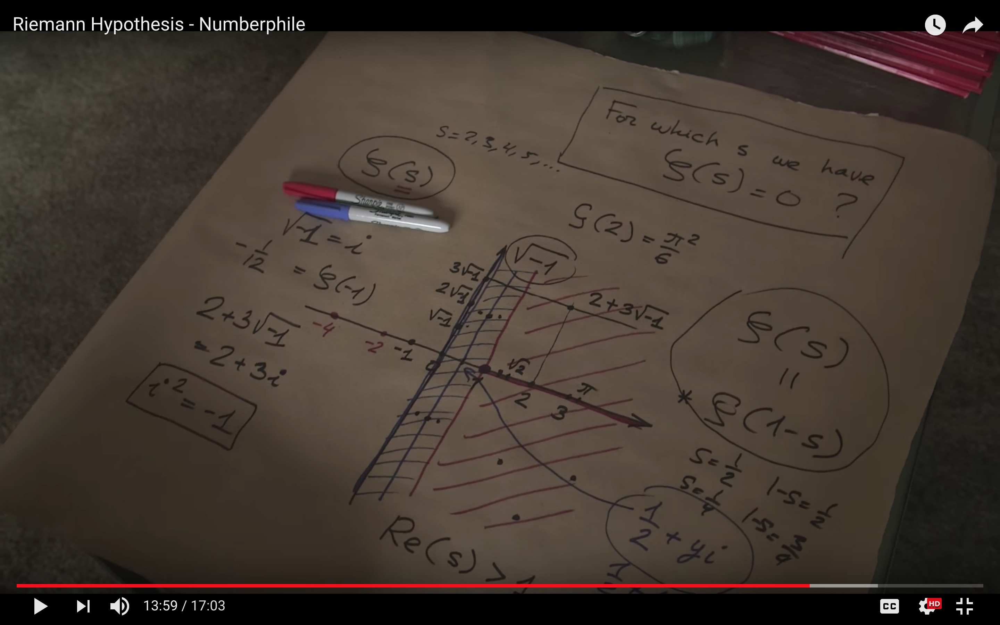

## Infinite Primes
[Numberphile](https://www.youtube.com/watch?v=ctC33JAV4FI)

There are infinitely many primes.

Proof by contradiction: if all primes are $ p_1, p_2, ..., p_n $, then $ Q = p_1 * p_2 * ... * p_n + 1 $ is either prime or not.

If Q is prime, it's bigger than any prime on the list.
If Q not prime, it needs to be divisible by some primes on the list. But it's not, because it's one-off form being divisible by any prime on the list, which means there are other primes missing from the list.

**Euclid's elements** is a textbook that is 2300 years old, never been out of print. Second one after the bible.

Euclid didn't have algebra, so he represents numbers by lines. A prime is a line that can be measured precisely only by unit-length lines (not 2s, 3s etc).

## Twin Prime Conjecture
[Numberphile](https://www.youtube.com/watch?v=QKHKD8bRAro)

Twin primes: p, p+2. Conjecture: for any n there is a pair of twin primes bigger than n.

There are two ways of proving this: Yitang Zhang proved that there always is a pair at the distance < 70M. There was a Polimath project to optimize the limit and got it down to < 4680.

Different approach (based on sieve) proved that the gap is < 246. With really optimistic assumptions it may be possible to prove the gap < 6, but not equal to two. The approach uses probabilistic method of finding primes.

## Riemann Hypothesis
[Numberphile](https://www.youtube.com/watch?v=d6c6uIyieoo)

One of the 7 millenium form year 2000 (only 1 solved).

Riemman zeta function: $ \zeta(s) = 1/1^s + 1/2^s + 1/3^s + ... $

$ \zeta(s) $ is convergent for s > 1. It also works for complex numbers and is converget for the real part > 1.

$ \zeta(s) $ is a holomorphic function, which means it cane be analitically continued to all complex numbers. It has a singularity for s=1.

Riemman hypothesis: all not-trivial zeros of $ \zeta(s) $ are on the line of $ (1/2 + bi) $

Location of zeros of the function is related to distribution of prime numbers - there's a formula that tells you how many primes are between 1 and n.

TODO: look up Fermat's last theorem

## Prime Number Theorem
[Numberphile](https://www.youtube.com/watch?v=l8ezziaEeNE)

Prime Number Theorem: there are $ \pi(n) \approx \frac n{ln(n)} $ primes smaller than n.

n-th prime is approximately $ n log(n) $.

Bertrand's postulate: there's always a prime between n and 2n. For n > 100, there's always a prime between n and 1.2n.
